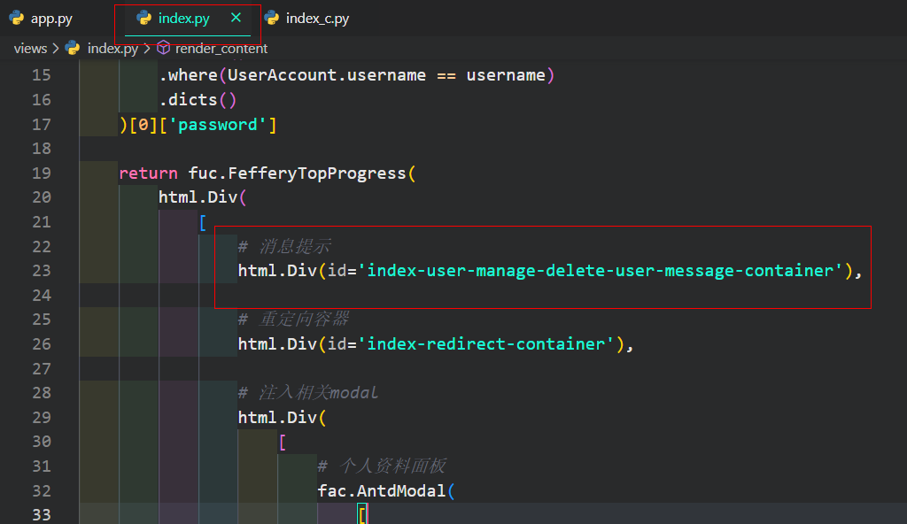

# 第3课：在第2课基础上进行升级改良

　　在本微型课程第2课的基础上，进行一些升级&改良，其中具体有：


## 1 改良的部分

### 1.1 将消息提示所输出的容器调整到合适的位置

　　在第2课中，id为`index-user-manage-delete-user-message-container`的容器由于是置放于回调函数`index_user_manage_modal_update_children()`的返回结果中，即置放于`Modal`内部，会导致已被返回的`fac.AntdMessage()`组件在`Modal`关闭再打开后会**重复出现**一次，如下列视频所示：

<video src="文档附件/video1.mp4"></video>
　　要解决此类问题，只需要将`fac.AntdMessage()`输出的容器调整到`Modal`外即可，譬如本节课中移动至如图所示位置：

<center></img></center>
### 1.2 为主页面侧边栏菜单项添加基于hash的路由回调

　　在第2课中的工程里，当登录成功进入主页面后，我们通过点击侧边菜单栏代表不同子应用的菜单项，进而改变右侧主体页面内容，使用的是`AntdMenu()`的`currentKey`作为输入，对应工程中的回调函数`index_render_main_content()`，这是一种简单的处理方式，但如果你希望用户可以通过对应网址直接访问到子应用，就需要配合`dcc.Location()`以及为`AntdMenu()`中的各个菜单项设置`href`网址信息，我们基于此做适当改造：

> 改造后的侧边菜单栏组件

```Python
fac.AntdMenu(
    id='index-side-menu',
    menuItems=[
        {
            'component': 'Item',
            'props': {
                'key': '首页',
                'title': '首页',
                'icon': 'antd-home',
                'href': '/'
            }
        },
        {
            'component': 'SubMenu',
            'props': {
                'key': '子应用',
                'title': '子应用',
                'icon': 'antd-app-store'
            },
            'children': [
                {
                    'component': 'Item',
                    'props': {
                        'key': f'子应用{i}',
                        'title': f'子应用{i}',
                        'icon': 'antd-app-store',
                        'href': f'/sub-app{i}'
                    }
                }
                for i in range(1, 25)
            ]
        }
    ],
    mode='inline',
    openKeys=['子应用'],
    style={
        'width': '100%',
        'height': '100%'
    }
)
```

> 改造后的`index_render_main_content()`回调函数

```Python
@app.callback(
    Output('index-main-content-container', 'children'),
    Input('url', 'pathname')
)
def index_render_main_content(pathname):

    if pathname == '/':
        return [
        fac.AntdSpace(
            [
                fac.AntdResult(
                    status='info',
                    title='欢迎来到首页',
                    style={
                        'boxShadow': '0 6px 16px rgb(107 147 224 / 14%)'
                    }
                )
            ] * 20,
            direction='vertical',
            size='large',
            style={
                'width': '100%'
            }
        ),
        fac.AntdBackTop()
    ]

    return [
        fac.AntdSpace(
            [
                fac.AntdResult(
                    status='info',
                    title=f'欢迎来到{pathname[1:]}',
                    style={
                        'boxShadow': '0 6px 16px rgb(107 147 224 / 14%)'
                    }
                )
            ] * 20,
            direction='vertical',
            size='large',
            style={
                'width': '100%'
            }
        ),
        fac.AntdBackTop()
    ]
```

> 为了确保当用户直接通过某个子应用网址访问后，侧边菜单栏自动选择到对应的菜单项，我们需要新增类似下面的回调函数

```Python
@app.callback(
    Output('index-side-menu', 'currentKey'),
    Input('url', 'pathname')
)
def index_update_current_key(pathname):

    if pathname == '/':
        return '首页'

    return '子应用' + re.sub('^/sub-app', '', pathname)
```

> `config.py`中改造后的合法`pathname`参数

```Python
# 合法pathname列表
VALID_PATHNAME = [
    '/', '/login',
    *[
        f'/sub-app{i}'
        for i in range(1, 25)
    ]
]
```

　　这样改造之后，实现的效果就如下面视频所示，但是由于我们有两个涉及页面内容渲染的回调函数都使用到

`dcc.Location()`的`pathname`作为输入，因此如视频中控制台打印的信息所示，我们在切换子应用或直接访问子应用时，按照渲染顺序，回调`router()`先渲染出`index.py`中的主页面骨架，从而保证回调`index_render_main_content()`中的各个角色都出现在页面中后，才接着触发了子应用渲染逻辑：

<video src="文档附件/video2.mp4"></video>
　　这在直接使用子应用网址访问渲染的过程中是看不出异常的，但当用户手动点击左侧菜单项，就会出现**页面闪烁**的情况，毕竟回调`router()`在用户每次点击新的菜单项导致`pathname`改变后，逻辑上都会对整体页面进行刷新，要解决这个问题方式有很多，易操作的一种方式是将我们子应用渲染的回调输入角色由`pathname`改为`hash`，即网址中`#`后的内容，当然相应的我们也要微调一些相关的内容，具体如下：

> 改造后的侧边菜单栏组件，将`href`改为`#hash`形式

```Python
fac.AntdMenu(
    id='index-side-menu',
    menuItems=[
        {
            'component': 'Item',
            'props': {
                'key': '首页',
                'title': '首页',
                'icon': 'antd-home',
                'href': '/'
            }
        },
        {
            'component': 'SubMenu',
            'props': {
                'key': '子应用',
                'title': '子应用',
                'icon': 'antd-app-store'
            },
            'children': [
                {
                    'component': 'Item',
                    'props': {
                        'key': f'子应用{i}',
                        'title': f'子应用{i}',
                        'icon': 'antd-app-store',
                        'href': f'#sub-app{i}'
                    }
                }
                for i in range(1, 25)
            ]
        }
    ],
    mode='inline',
    openKeys=['子应用'],
    style={
        'width': '100%',
        'height': '100%'
    }
)
```

> 还原`config.py`中改造后的合法`pathname`参数

```Python
# 合法pathname列表
VALID_PATHNAME = [
    '/', '/login'
]
```

> 改造后的`router()`、`index_update_current_key()`及`index_render_main_content()`

```Python
@app.callback(
    Output('index-side-menu', 'currentKey'),
    Input('url', 'hash')
)
def index_update_current_key(hash):

    if hash == '':
        return '首页'

    return '子应用' + re.sub('^#sub-app', '', hash)


@app.callback(
    Output('index-main-content-container', 'children'),
    Input('url', 'hash'),
    State('url', 'pathname'),
)
def index_render_main_content(hash, pathname):

    if pathname == '/':

        if hash == '':
            return [
                fac.AntdSpace(
                    [
                        fac.AntdResult(
                            status='info',
                            title='欢迎来到首页',
                            style={
                                'boxShadow': '0 6px 16px rgb(107 147 224 / 14%)'
                            }
                        )
                    ] * 20,
                    direction='vertical',
                    size='large',
                    style={
                        'width': '100%'
                    }
                ),
                fac.AntdBackTop()
            ]

        return [
            fac.AntdSpace(
                [
                    fac.AntdResult(
                        status='info',
                        title=f'欢迎来到{hash[1:]}',
                        style={
                            'boxShadow': '0 6px 16px rgb(107 147 224 / 14%)'
                        }
                    )
                ] * 20,
                direction='vertical',
                size='large',
                style={
                    'width': '100%'
                }
            ),
            fac.AntdBackTop()
        ]

    return dash.no_update
```

　　效果如下，因为我们消除了多个页面内容渲染回调同时受`pathname`控制的现象，所以每次点击侧边菜单栏时，`pathname`部分是没有变化，只有`hash`部分发生变化，因此页面切换就很丝滑：

<video src="文档附件/video3.mp4"></video>
## 2 新增的内容

### 2.1 新增用户子应用访问权限配置

　　有些情况下，我们针对某些用户，只希望他们可以访问部分的子应用，这种时候我们就可以用额外的用户权限表来限制某些用户的访问范围，以我们示例工程中已创建的用户`feffery`（密码：`feffery`）为例，只希望他可以访问子应用10到15之间的内容，效果如下面的视频所示（包含了对不存在子应用的访问提示）：

<video src="文档附件/video4.mp4"></video>

　　其中涉及到`models`下新增的`authority.py`，对其中存在记录的用户限制了可访问的子应用范围（不存在则默认不限制访问），以及针对已有代码的下列改动，你可以在附近工程中仔细查看其逻辑：

> - 针对`server.py`中的`load_user()`新增`accessible_apps`属性的写入
>
> - `config.py`中新增的`VALID_HASH`参数
> - `index.py`中基于用户`accessible_apps`信息的侧边菜单栏推导
> - `index_c.py`中基于用户`accessible_apps`信息与`VALID_HASH`参数的权限提示、无效页面提示

---

## 3 课后作业

　　通过本微型课程中的各个简单示例，我们掌握了基于`flask-login`实现灵活自由的用户登录、权限控制，在日常工作中编写`Dash`应用时，我们需要在理解这些内容原理的基础上，封装为更为复杂的功能、更为精致易交互的界面，本期的课后作业要求：

> 请你在第3课附件工程的基础上，参考“用户管理”交互操作页面的触发方式，针对用户权限控制编辑开发出简易的交互式界面，不一定需要基于表格组件，请学有余力的同学思考如何方便地实现，并发帖打卡附上演示视频完成作业