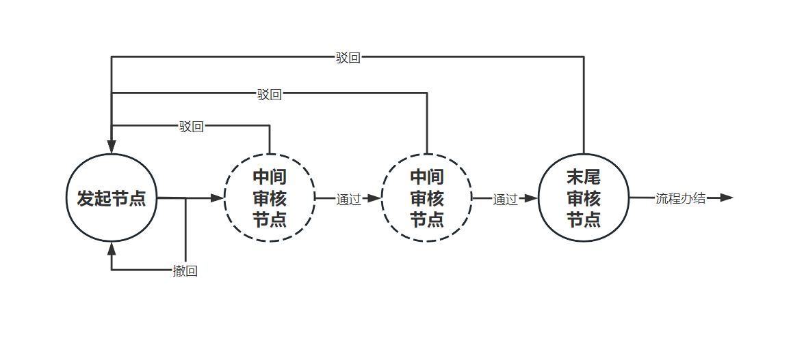
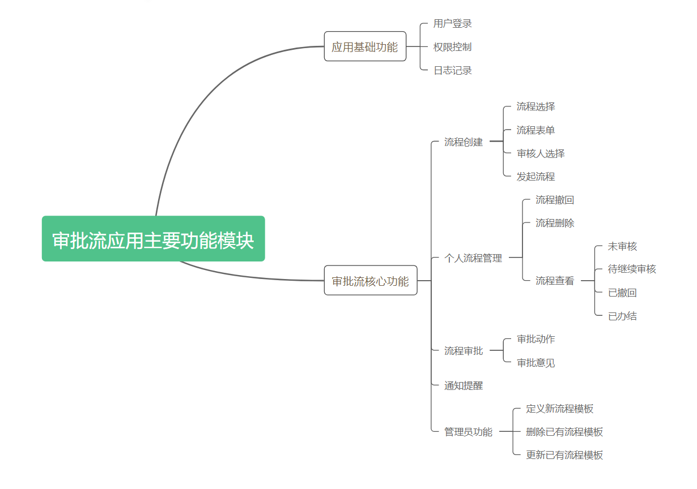

# *玩转dash知识星球微型项目课程*

## 【一起写个审批流应用】

### 第1讲：审批流应用的主要功能概念

*玩转dash：费弗里*

---

#### 1 相关功能概念

##### 1.1 什么是审批流

　　流程审批是企业应用中常见的功能，用于管理和控制日常业务流程，从而提升整体业务流程的透明度和可追溯性，提升企业管理水平。

##### 1.2 审批流应用中的主要功能概念

　　要构建一套标准的审批流应用功能，通常必须包含以下功能，对这些功能逻辑的分析可以非常有效地指导我们在下一节课中进行数据库的设计及验证：

###### 1.2.1 审批流程的创建

　　具有不同角色的用户在自己可发起的若干流程中进行选择，从而创建具有若干审批步骤的流程，为了支持这个过程，我们需要设计`用户信息表`、`职级信息表`、`部门信息表`以及`流程元信息表`，这其中的部分表也是我们开发基础登录功能所需要依赖的。

###### 1.2.2 审批流程控制

　　当某条审批流程被创建后，就应当被记录和追踪其实时状态，基于上面的示意图所示，有以下几种具体的状态：

- *发起人*创建流程后，流程流向下一步骤的*审批人*，但还未被审批时，可称作**未审核**状态
- *发起人*针对处于**未审核**状态的流程，应具有撤回的能力，当撤回发生后，可称作**撤回修改中**状态，*发起人*可针对处于此种状态的流程记录进行编辑再提交审核或删除操作
- 当发起的流程开始在后续的节点中流转审核时，每一步的*审核人*都可以根据*发起人*填写的表单内容自行决定是<u>通过</u>还是<u>退回</u>当前流程，我们可以根据审核节点是否为<u>最后一个节点</u>，进一步划分为以下动作：
  - 当流程被任意审核节点<u>驳回</u>后，应当携带相应的<u>审核意见</u>，回退到*发起节点*，这种状态可称作**驳回修改中**状态
  - 当流程被至少一个*中间审核节点*予以通过，且尚未被*末尾审核节点*审核时，这种状态可称作**待继续审核**状态
  - 当流程被*末尾审核节点*予以通过后，当前流程即全部走完，这种状态可称作**已办结**状态

　　经过这样一番梳理过后，我们的流程控制就非常清晰了，也明确了我们需要设计`流程记录表`来协助推进和记录每一条流程的流转状态，并附带记录丰富的流程行为相关信息，从而为应用中针对流程信息的可视化查看展示提供数据资料。

###### 1.2.3 通知提醒

　　对于任意一条流程的参与人员——即*发起人*和若干*审批人*，他们应当在流程状态切换到与自己相关时，接受到相应的通知提示，据此我们可梳理出以下通知提示触发点：

- 新流程创建成功后，需要对*发起人*进行成功通知
- 新流程撤回成功后，需要对*发起人*进行撤回成功通知
- 对于*审批人*而言，当出现下一节点*审批人*为自己的新流程状态时，需要对该*审批人*进行待审核通知
- 对于*发起人*而言，当针对他新增了一条被驳回的流程时，需要对该*发起人*进行待修改通知
- 对于*发起人*而言，当针对他新增了一条已办结的流程时，需要对该*发起人*进行已办结通知

　　据此，我们需要设计`通知记录表`。

###### 1.2.4 审批流程的定义及管理

　　可拓展性是一个应用生命力的重要体现，而流程作为审批流应用中的关键，在应用中研发<u>新流程编排设计</u>、<u>旧流程删除</u>、<u>旧流程更新</u>等快捷功能非常重要，因为我们不能指望除了研发人员之外的其他应用管理人员可以学会直接对数据库中的`流程元信息表`进行增删改，并且要以尽量低代码或零代码的交互方式实现这些功能。

#### 2 确立需要开发的主要功能模块

　　在上述分析的基础上，结合对平台基础功能的补充，我们可以确立我们的审批流应用应具有的功能模块主要有：

　　接下来的课程中，我们就将基于本节课所梳理的应用功能，基于`Dash`+`FastAPI`+`SQLite`+`MongoDB`的示例技术栈，从数据库设计到后端服务开发，再到前端`dash`应用的构建，来详细介绍要完成这样一个功能实用的审批流应用需要做的规定动作，冲冲冲🚀🚀🚀

---

> 课后作业
>
> 　　请在认真学习本节课所述内容的基础上，谈谈你对审批流应用相关功能的理解，亦可进行一些你认为必要的相关功能的补充，请单独发帖带上#课后作业#话题，注明“一起写个审批流应用课程第1讲课后作业”

