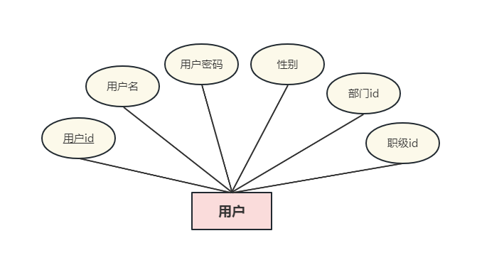
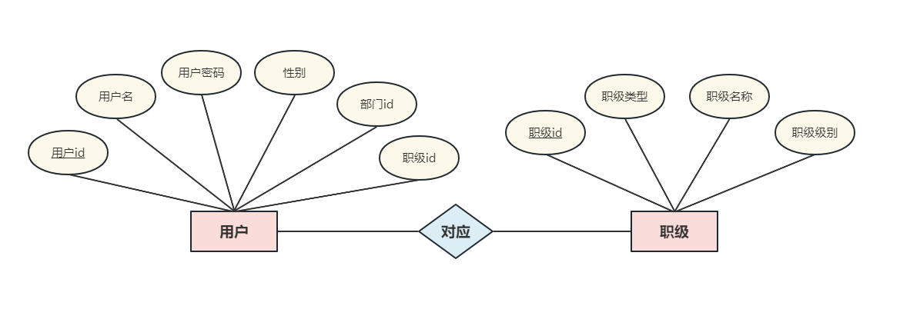
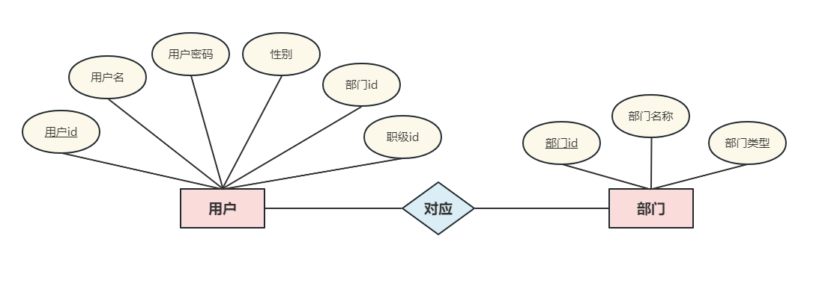
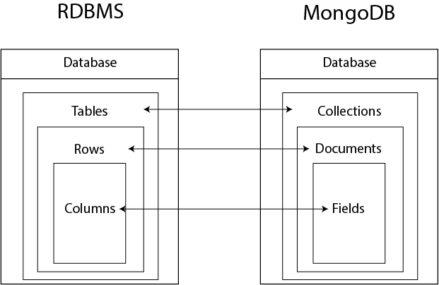
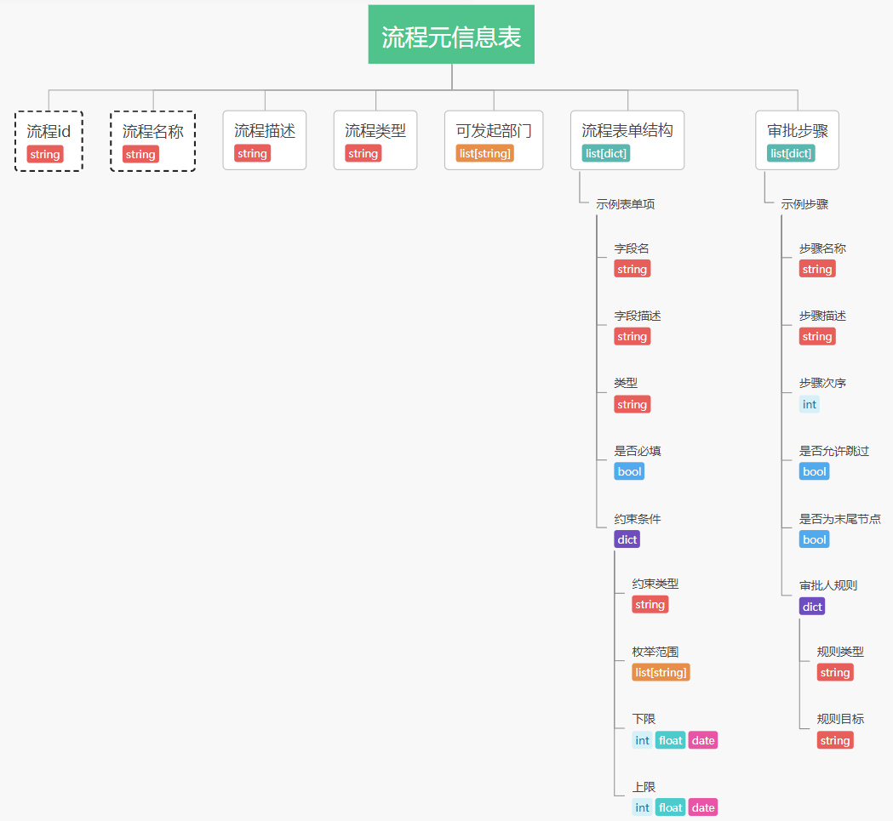
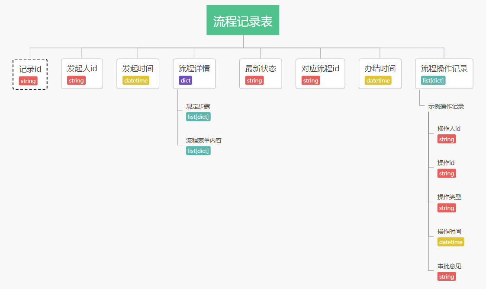
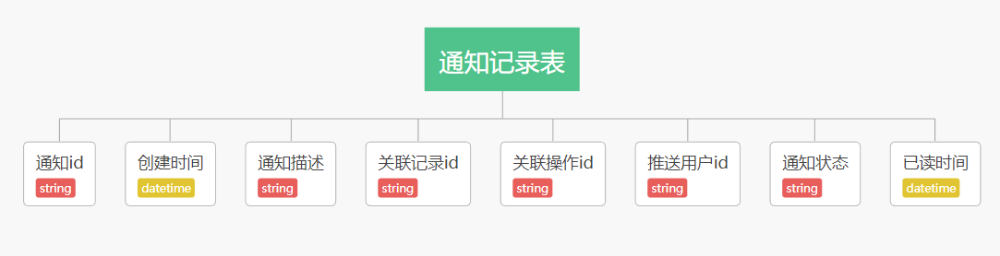

# *玩转dash知识星球微型项目课程*

## 【一起写个审批流应用】

### 第2讲：数据库设计

*玩转dash：费弗里*

---

#### 1 基于功能需求展开数据库选型和设计

　　在上一讲中，我们详细梳理了要开发一个审批流应用，所需要完成的常见标准功能，其中也提及了一些需要用来支撑应用功能的数据表，我们需要根据不同数据表所存储数据内容结构的差异，来率先做好数据库选型：

##### 1.1 适用于关系型数据库的表

　　在我们的应用中，关系型数据库经典的二维表形式适合用来存储一些结构扁平的数据，下面的内容中我们将使用形式简单的**ER图**来设计各个表及表之间的关联关系，说明内容中带下划线的字段为对应表的主键：

###### 1.1.1 用户信息表

　　我们的审批流应用最基本的是用户登录功能，因此需要为此单独设计一张表来存储和管理每个用户的账号信息，应具有的字段有<u>*用户id*</u>、*用户名*、*用户密码*、*性别*、*部门id*、*职级id*，其中*部门id*和*职级id*用于从其他表关联更多信息以支持权限相关功能：

<center ></center>

###### 1.1.2 职级信息表

　　在上面的`用户信息表`中，每条记录中的*职级id*用于从`职级信息表`中关联当前用户的职级相关信息，不同的单位职级分类规则五花八门，在本课程中为方便演示和推广，仅作简单设定，我们为`职级信息表`设计的字段有<u>*职级id*</u>、*职级类型*、*职级名称*、*职级级别*，其中*职级类型*假设分为**专业技术类**、**行政管理类**和**业务营销类**，*职级级别*分为**普通职员**、**部门副职**、**部门正职**、**公司副职**、**公司正职**：

<center ></center>

###### 1.1.3 部门信息表

　　每一位用户相应的还有其对应的部门相关信息，我们可以设计`部门信息表`，通过*部门id*字段为每条用户信息关联对应的部门信息，涉及到的字段有<u>*部门id*</u>、*部门名称*、*部门类型*，其中*部门类型*我们在本课程中假设有**研发类**、**业务类**和**行政管理类**三种：

<center ></center>

　　通过上面三张表的构建，我们就可以完整的描述一名用户身份相关的必要信息了，譬如：

> 张三在平台中的id是`f19ced42-8c0a-4412-b2d3-5eec24fe1bb5`，他是数字营销部的业务营销类普通职员

##### 1.2 适用于非关系型数据库的表

　　不同于关系型数据库中的二维表结构，在非关系型数据库中，每个数据库下用集合（*Collection*）代替表的概念，每个集合下用文档（*Document*）代替行记录的概念：

<center ></center>

　　而每个文档的数据结构是非常自由的，你可以在某个集合中插入若干条数据结构迥然不同的*JSON*数据，随便你怎么嵌套都行，譬如下面例子中第一层平行的两条数据就可以存放在同一个文档里：

```json
{
    name: 'a',
    records: [
        {
            id: 1,
            status: 'success'
        },
        {
            id: 2,
            status: 'error'
        }
    ]
},

{
    name: 'b',
    fields: {
        count: 2,
        details: [
            {
                title: 'A'
            },
            {
                title: 'B'
            }
        ]
    }
}
```

　　而我们的审批流程相关的数据信息，由于是跟应用中的各种复杂功能相呼应的，譬如某条流程有n个子步骤，每个步骤又有相关的规则定义等细节信息，如果用关系型数据库二维表存储这些明显带有分层嵌套特点的信息，则需要设计很多张表，且相关表之间的关联非常复杂，且如果后续有新的功能升级需求，重构起来十分蛋疼。

　　因此在此业务场景下使用非关系型数据库非常必要（本课程以`MongoDB`为例），对于非关系型数据库的表设计比较自由，下面我们以导图为例来进行设计：

###### 1.2.1 流程元信息表

　　`流程元信息表`是我们用于定义每条流程标准过程的关键，对其进行完善的字段设计可以帮助我们在应用中很轻松的开发相关功能逻辑，下面的导图描述了用于定义每一条流程所需的常规字段，我们会在下一节课中通过实际代码做更详细的完善：

<center ></center>

###### 1.2.2 流程记录表

　　为了对用户在应用中发起的每条流程做追踪记录，我们需要设计`流程记录表`，每次有用户发起新的流程时，在此表中都相应的会创建新的一条文档，且该条文档会随着对应流程的流转操作进行相应的更新追加信息等操作，结构如下：

<center ></center>

###### 1.2.3 通知记录表

　　随着每段流程的流转推进，不同的操作人做出的不同操作，我们都需要在应用中为相关用户进行通知推送，因此要设计相应的`通知记录表`，具体结构设计如下：

<center ></center>

　　以上就是我们在本课程中构建审批流应用需要用到的一些关键表，其他辅助性质的表我们将在后面项目的实际开发讲解中做介绍。

---

> 课后作业
>
> 　　请在认真学习本节课所述内容的基础上，谈谈你对审批流应用相关数据表结构的学习心得，亦可进行一些你认为必要的补充说明，请单独发帖带上#课后作业#话题，注明“一起写个审批流应用课程第2讲课后作业”


