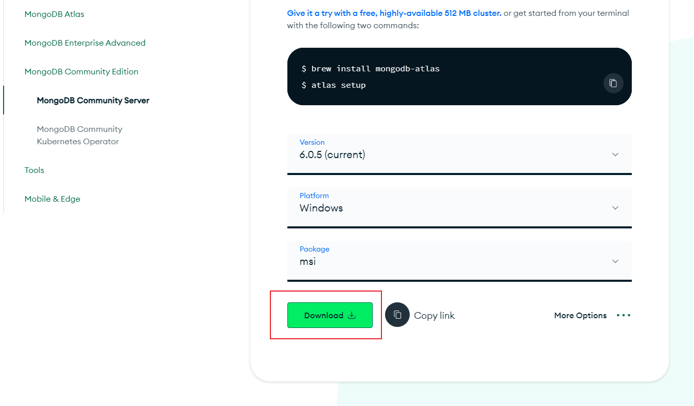
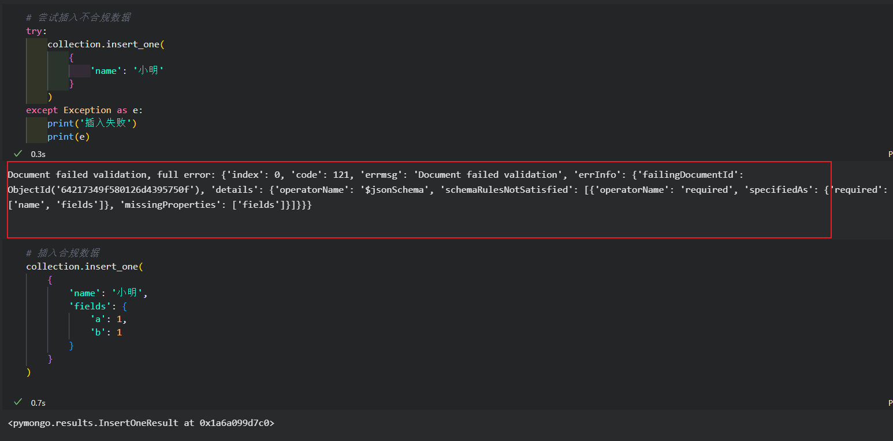

# *玩转dash知识星球微型项目课程*

## 【一起写个审批流应用】

### 第3讲：MongoDB的安装&基础使用

*玩转dash：费弗里*

---

#### 1 MongoDB的安装

　　在上一讲中我们以应用功能为导向，分别对`关系型数据库`和`非关系型数据库`中涉及到的一些表进行了设计，其中`关系型数据库`本课程为了方便演示就使用自带的`SQLite`数据库，而`非关系型数据库`我们则选用主流的`MongoDB`，其功能丰富健全，是比较成熟的`非关系型数据库`。

　　`linux`系统中推荐使用`docker`对`MongoDB`进行安装使用，这里就不赘述，我们为了方便大家在自己的个人电脑上进行学习，下面就详细介绍`windows`上安装`MongoDB`的方法：

##### 1.1 安装MongoDB Server

　　访问`MongoDB`的[官网下载页](https://www.mongodb.com/try/download/community)，从如图所示位置下载`msi`安装包：

<center ></center>

　　下载完成后，照常进行安装，中间步骤如下：

<center ></center>

<center ></center>

<center ></center>

　　其中`Data Directory`和`Log Directory`你也可以自行修改路径：

<center ></center>

　　这一步左下角默认勾选的`MongoDB Compass`是官方的图形化管理工具，并不是必要的，你可以像我一样取消勾选：

<center ></center>

　　接着直接进行安装即可：

<center ></center>

<center ></center>

　　这样我们就完成了`MongoDB`服务的安装了。

##### 1.2 安装MongoDB Shell

　　`MongoDB`附带了一个简单的`Shell`操作工具，在当前版本中并不自带，我们需要对其进行额外安装，访问[官网下载页](https://www.mongodb.com/try/download/shell)，提供了免安装版本：

<center ></center>

　　下载完成后解压到你想要放置的位置，使用时找到解压文件中下图所示的`bin`路径，在终端中打开该位置，再直接执行`mongosh`命令即可进入到`mongosh`的终端界面：

<center ></center>

<center ></center>

　　这样我们就完成了`MongoDB Shell`的安装了，虽然绝大部分的操作我们都是在`pymongo`中完成的，但是平时有些管理类型的操作还是需要在`mongosh`中执行。

#### 2 在pymongo中操纵MongoDB

##### 2.1 服务端环境搭建

　　完成了`MongoDB`相关安装后，我们在当前课程中针对`MongoDB`的操作均可以在`pymongo`中完成，因为这部分内容按照项目架构设计，需要在服务端进行实现，所以我们这里就顺便先对本课程项目的服务端环境进行初始化，基于`conda`，直接执行下令命令即可（其他涉及的库我们在课程后面的内容中按照实际需要再进行安装和介绍），其中`ipykernel`和`autopep8`是为了方便开发阶段在`vscode`中使用`jupyter`和自动代码美化所需的，生产环境部署时可自行从环境配置中移除：

```bash
conda create -n approval-process-api python=3.8 -y && conda activate approval-process-api

pip install pymongo ipykernel autopep8 -i https://pypi.tuna.tsinghua.edu.cn/simple
```

##### 2.2 利用pymongo操纵MongoDB

　　执行完上述命令后，参考之前“一起dash（2022年版）”课程第一课的内容，我们随便创建个目录作为测试工程，基于`vscode`的`jupyter`插件新建个`ipynb`文件，来练习`pymongo`与本课程项目有关的一些操作：

<center ></center>

###### 2.2.1 连接到MongoDB

　　因为我们作为示例项目并没有创建用户，所以直接就可以连接到`MongoDB`：

```python
from pymongo import MongoClient

# 连接到本机默认MongoDB服务
client = MongoClient()
```

###### 2.2.2 连接或创建数据库

　　使用下列的命令可以连接到对应名称的数据库，如果你的目标数据库还未创建，执行下面的代码会自动进行数据库创建：

```bash
# 连接或创建示例数据库
db = client['demo']
```

###### 2.2.3 连接或创建集合

　　我们上节课中介绍过，在非关系型数据库`MongoDB`中，数据库下一层对应的不是表而是集合（*collection*），而针对集合，类似数据库的操作，在上一小节数据库对象的基础上，执行下面的代码即可连接到已有集合，或为对应数据库创建集合：

```python
# 连接或创建示例集合
collection = db['demo_collection']
```

###### 2.2.4 针对集合的增删改查

　　在对指定数据库的指定集合进行连接或创建后，我们先不着急学习其他进阶的用法，先来把最常用的增删改查操作方法过一遍：

- 增

　　我们可以使用集合对象的`insert_one()`方法每次向集合中插入单条数据：

```python
# 插入一条数据
collection.insert_one(
    {'name': '小明', 'fields': {'a': 1, 'b': 'xxx', 'c': [1, 2, 3]}}
)
```

　　也可以使用`insert_many()`方法每次插入多条数据：

```python
# 插入多条数据
collection.insert_many(
    [
        {'name': name, 'fields': {'a': 1, 'b': 'xxx', 'c': [1, 2, 3]}}
        for name in ['小王', '小张', '小李']
    ]
)
```

- 查

　　`MongoDB`中针对数据的查询方法非常灵活，同样是可以使用`find_one()`和`find_many()`两种方法，接受的第一个位置参数为字典，用于定义条件筛选规则，关于条件筛选规则的构造内容众多，下面以常用的一些情况为例，更多内容还需要实际使用时现查先用：

> 查询全部记录

<center ></center>

> 查询指定字段等于某个值的记录

<center ></center>

<center ></center>

> 对指定字段进行范围判断

<center ></center>

> 特殊的判断，以数组长度不为0进行判断为例

<center ></center>

　　而查询方法的第2个位置参数用于设置需要返回哪些字段，设置为`0`的字段则不会返回：

<center ></center>

- 改

　　类似的，我们可以使用`update_one()`和`update_many()`来基于指定条件对匹配记录的指定字段值进行更新，简单举几个例子：

> 更新指定字段值

<center ></center>

> 为目标数组追加值

<center ></center>

- 删

　　删就没什么好介绍的，也是使用`delete_one()`或`delete_many()`，但是要注意的是，当执行删除操作后，会立即执行，所以操作时请小心：

> 删除记录示例

<center ></center>

　　更多有关增删改查的操作，我们在后面的课程实操中根据实际需求再做介绍，大家感兴趣也可以提前学习一下`MongoDB`增删改查的更多方法。

###### 2.2.5 为集合创建索引

　　`MongoDB`中同样支持基于字段建立索引，从而实现数据查询加速、数据插入限制等功能，我们以用得最多的*唯一值索引*为例，可以看到，在成功创建唯一值索引后，新插入的数据如果与此索引约束冲突，就会抛出错误：

<center ></center>

###### 2.2.6 文档格式校验

　　在`MongoDB`中可以基于`JSONSchema`规则，为集合添加文档格式校验，从而达到规范插入数据格式的目的，具体的`JSONSchema`常用规则大家自行搜索学习，下面举一个实际的例子（请注意，我们需要在`create_collection()`中设置`validator`，因此请在最开始创建集合的时候使用它，否则需要将已有的集合删除再创建）：

```python
# 基于JSONSchema创建文档格式校验规则
# 删除示例collection
db.drop_collection('demo_collection')
db.create_collection(
    'demo_collection',
    validator={
        "$jsonSchema": {
            "bsonType": "object",
            "required": ["name", "fields"],
            "properties": {
                "name": {
                    "bsonType": "string"
                },
                "fields": {
                    "bsonType": "object",
                    "required": ["a", "b"]
                }
            }
        }
    }
)
collection = db['demo_collection']
```

　　初始化集合时设置好格式校验后，当有即将插入的数据不符合格式校验要求时，会抛出错误：

<center ></center>

　　其他相关的`MongoDB`及`pymongo`知识，我们会在后面的项目实操中补充介绍。

---

> 课后作业
>
> 　　请在认真学习本节课所述内容的基础上，在本机完成MongoDB的安装及相关环境的搭建，并在名为`demo3`的数据库中构建集合`demo_collection`，具体要求如下：
>
> - 需包含格式校验，具体规则：
>   - 第一层必须具有字段`name`、`value`、`details`，其中`name`为字符串，`value`为数值，`details`为对象
>   - `value`字段最小值不得低于0，最大值不得高于10000
>   - `details`字段必须包含键值对`records`，且`records`为数组，数组最低元素数不得低于1
> - 为`name`字段创建唯一值约束
> - 在上述已创建集合的基础上，自行构造模拟数据向集合中插入100条伪造数据，依次演示增删改查操作，将关键代码及结果截图作为打卡发帖内容 
>
> 　　请单独发帖带上#课后作业#话题，注明“一起写个审批流应用课程第3讲课后作业”


