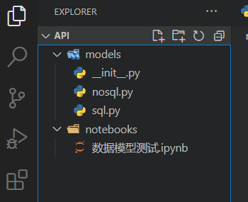

# *玩转dash知识星球微型项目课程*

## 【一起写个审批流应用】

### 第4讲：构建所需的数据库模型类

*玩转dash：费弗里*

---

　　在上一节课中，我们一起安装配置了`MongoDB`，并基于`pymongo`实践了针对`MongoDB`的常见操作技法。在今天的课程中，我们将基于前面所介绍的知识，开始搭建后端服务项目中用于支撑平台主要功能的数据库模型类，这是我们搭建应用功能的基石，我将从关系型数据库和非关系型数据库两个方面分别来介绍：

#### 1 关系型数据库模型类构建

　　关系型数据库构建模型类的相关概念和实操，我们在*玩转dash*星球已积累的系列课程*一起Dash！（2022年版）*中的[第10课](https://t.zsxq.com/0cNWURnYL)、[第11课](https://t.zsxq.com/0cUzGVn0z)、[第12课](https://t.zsxq.com/0c3rsj7qZ)中已做过详细介绍，本节课中我们直接撸起袖子开写（请先在上节课中新建的虚拟环境`approval-process-api`中安装这节课要用到的**ORM**库`peewee`）。

　　本课程示例项目中为了方便演示，关系型数据库采用`SQLite`，因为是作为后端服务工程中的正式内容，所以请大家自行选择合适的路径创建`api`文件夹，作为工程打开，如下图所示先建立名为`models`的包，测试用的`notebooks`文件夹，并创建好图中所示的各个空文件：

<center ></center>

　　关系型数据库的模型类我们在`models/sql.py`中进行**初步**构建，部分代码如下，其中`用户信息表`

```python
class UserInfo(Model):

    # 用户id，主键
    user_id = CharField(primark_key=True)

    # 用户名
    user_name = CharField()

    # 密码
    password = CharField()

    # md5加密密码，用作登陆鉴权时安全校验使用
    md5_password = CharField()

    # 性别
    gender = CharField()

    # 部门id
    department_id = IntegerField()

    # 职级id
    rank_id = IntegerField()

    class Meta:

        database = sql_db
        table_name = 'user_info'
```

　　`职级信息表`：

```python
class RankInfo(Model):
    '''
    职级信息表
    '''

    # 职级id
    rank_id = IntegerField(primary_key=True)

    # 职级类型
    rank_type = CharField()

    # 职级名称
    rank_name = CharField()

    # 职级级别
    rank_level = CharField()

    class Meta:

        database = sql_db
        table_name = 'rank_info'
```

　　`部门信息表`：

```python
class DepartmentInfo(Model):
    '''
    部门信息表
    '''

    # 部门id
    department_id = IntegerField(primary_key=True)

    # 部门名称
    department_name = CharField()

    # 部门类型
    department_type = CharField()

    class Meta:

        database = sql_db
        table_name = 'department_info'
```

　　完成上述三张关系型数据表模型类的初始化构建后，别忘记添加上下列的代码进行建表：

```python
# 若数据库中不存在相关表，则自动创建
sql_db.create_tables([UserInfo, RankInfo, DepartmentInfo])
```

　　在此初始化的基础上，推荐大家像我接下来一样在`jupyter`中进行相关功能的测试和验证，验证通过的代码片段就可以在之后重构组织到不同的模块中，我们以*用户登陆时的信息验证功能*为例，完整代码你可以在附件中的`数据模型测试.ipynb`中找到：

- 导入相关模块

```python
import hashlib
# 注：这里由于是在notebooks/数据模型测试.ipynb中执行代码
# 因此针对数据库模型所生成的SQLite对应db文件与当前ipynb文件同级
# 好处是不会与基于项目根目录启动后创建的db文件相冲突
from models.sql import sql_db, UserInfo
```

- 定义字符串转md5值工具函数

　　为了更便于将用户原始密码转换为更安全的md5值，我们定义下列工具函数，此函数后面将被整合到`api`工程下的`utils.py`模块中：

```python
def str2md5(raw_str: str) -> str:
    """对字符串进行md5加密

    Args:
        raw_str (str): 输入的待加密字符串

    Returns:
        str: 加密后的md5值
    """

    m = hashlib.md5()
    m.update(raw_str.encode('utf-8'))

    return m.hexdigest()
```

- 插入单条测试用模拟数据

```python

# 向用户信息表中插入单条测试用模拟数据
with sql_db.atomic():

    # 若测试表中无下列测试数据，则进行插入
    if UserInfo.select(UserInfo.user_id == 'test').count() == 0:
        UserInfo.create(
            user_id='test',
            user_name='张三',
            password='test_password',
            md5_password=str2md5('test_password'),
            gender='男',
            department_id=1,
            rank_id=1
        )

# 查询插入的测试数据
list(UserInfo.select().where(UserInfo.user_id == 'test').dicts())
```

<center ></center>

　　经过上面的步骤，我们就完成了针对*用户登陆时的信息验证功能*这个功能单元的测试准备工作，下面通过简单的代码模拟出此功能的各个条件场景即可：

- 构建鉴权逻辑函数

```python
# 模拟用户登陆鉴权验证，这里将具有唯一性的user_id视作登陆用户名

def check_user_auth(user_id: str,
                    md5_password: str) -> dict:

    # 尝试根据输入的user_id查询用户信息记录
    with sql_db.atomic():
        match_records = (
            UserInfo
            .select()
            .where(UserInfo.user_id == user_id)
            .dicts()
        )

    # 判断当前用户是否存在
    if match_records:
        # 继续判断md5密码是否正确
        if match_records[0]['md5_password'] == md5_password:
            return {
                'status': 'success',
                'message': '当前用户鉴权通过',
                'data': match_records[0]
            }

        return {
            'status': 'error',
            'message': '当前用户密码错误'
        }

    return {
        'status': 'error',
        'message': '当前用户不存在'
    }
```

- 模拟测试

<center ></center>

　　通过这样一段标准的过程，我们就可以围绕数据库，完成不同功能单元的验证测试，在此基础上，就可以将其中的关键代码整合到不同的功能模块中，作为项目正式的逻辑，譬如，将字符串转md5值的工具函数组织到`api/utils.py`中：

<center ></center>

　　将用户登录信息鉴权函数重构作为数据模型类`UserInfo`的一个`classmethod`，以方便调用：

```python
class UserInfo(Model):
    '''
    用户信息表
    '''

    # 用户id，主键
    user_id = CharField(primary_key=True)

    # 用户名
    user_name = CharField()

    # 密码
    password = CharField()

    # md5加密密码，用作登陆鉴权时安全校验使用
    md5_password = CharField()

    # 性别
    gender = CharField()

    # 部门id
    department_id = IntegerField()

    # 职级id
    rank_id = IntegerField()

    @classmethod
    def check_user_auth(cls,
                        user_id: str,
                        md5_password: str) -> dict:
        """用户根据输入的user_id和md5_password进行鉴权

        Args:
            user_id (str): 用户登录id
            md5_password (str): 用户所填密码的md5加密值

        Returns:
            dict: 鉴权状态及附加信息
        """

        # 尝试根据输入的user_id查询用户信息记录
        with sql_db.atomic():
            match_records = (
                cls
                .select()
                .where(cls.user_id == user_id)
                .dicts()
            )

        # 判断当前用户是否存在
        if match_records:
            # 继续判断md5密码是否正确
            if match_records[0]['md5_password'] == md5_password:
                return {
                    'status': 'success',
                    'message': '当前用户鉴权通过',
                    'data': match_records[0]
                }

            return {
                'status': 'error',
                'message': '当前用户密码错误'
            }

        return {
            'status': 'error',
            'message': '当前用户不存在'
        }

    class Meta:

        database = sql_db
        table_name = 'user_info'
```

　　通过这样的过程，我们就可以很清楚的设计构建我们应用中主要逻辑的相关功能单元。

#### 2 非关系型数据库模型类构建

　　在上一节中，我们介绍了针对关系型数据库中的相关表构建**ORM**模型类并进行功能测试的通用模式，接下来将视线切到非关系型数据库这边，因为`pymongo`本身的操作方式就是面向对象的，所以我们直接基于`pymongo`进行封装即可，先以`流程元信息表`为例打个样，其中主要是在`jsonschema`格式校验规则的定义上花功夫（完整代码见`models/nosql.py`），其中数据模型类的静态方法`init_collection()`用于重置数据库使用：

```python
class ProcessMeta:
    """
    流程元信息表
    """

    def __init__(self) -> None:

        # 取得process_meta对应集合
        self.collection = nosql_db['process_meta']

    @staticmethod
    def init_collection() -> None:
        """慎用，用于强制初始化process_meta表，执行后会首先清除process_meta表，再创建process_meta表"""

        # 清除process_meta表
        nosql_db.drop_collection('process_meta')

        # 创建process_meta表
        nosql_db.create_collection(
            'process_meta',
            validator={
                '$jsonSchema': {
                    'bsonType': 'object',
                    'required': [
                        '流程id', '流程名称', '流程描述', '流程类型',
                        '可发起部门', '流程表单结构', '审批步骤'
                    ],
                    'properties': {
                        '流程id': {
                            'bsonType': 'string',
                            'description': '用于存储当前元信息对应流程的唯一标识'
                        },
                        '流程名称': {
                            'bsonType': 'string',
                            'description': '用于存储当前元信息对应流程的名称'
                        },
                        '流程描述': {
                            'bsonType': 'string',
                            'description': '用于存储当前元信息对应流程的描述'
                        },
                        '流程类型': {
                            'bsonType': 'string',
                            'description': '用于存储当前元信息对应流程的类型'
                        },
                        '可发起部门': {
                            'bsonType': 'array',
                            'description': '用于存储当前元信息对应流程的可发起部门，当存在“全部”项时，用于表示当前流程可由全部部门发起',
                            'items': {
                                'bsonType': 'string'
                            }
                        },
                        '流程表单结构': {
                            'bsonType': 'array',
                            'description': '用于存储当前元信息对应流程的需填写表单结构',
                            'items': {
                                'bsonType': 'object',
                                'required': [
                                    '字段名', '字段描述', '类型', '是否必填'
                                ],
                                'properties': {
                                    '字段名': {
                                        'bsonType': 'string',
                                        'description': '声明当前表单项的字段名'
                                    },
                                    '字段描述': {
                                        'bsonType': 'string',
                                        'description': '声明当前表单项的字段描述'
                                    },
                                    '类型': {
                                        'bsonType': 'string',
                                        'description': '声明当前表单项的类型，可选的有字符型、整型、浮点型、年份型、年月型、日期型、日期时间型及时间型'
                                    },
                                    '是否必填': {
                                        'bsonType': 'bool',
                                        'description': '声明当前表单项是否必填'
                                    },
                                    '约束条件': {
                                        'bsonType': 'object',
                                        'description': '声明当前表单项的约束条件',
                                        'required': ['约束类型'],
                                        'properties': {
                                            '约束类型': {
                                                'bsonType': 'string',
                                                'description': '声明当前表单项的约束类型，可选的范围约束、枚举约束'
                                            },
                                            '枚举范围': {
                                                'bsonType': 'array',
                                                'description': '声明当前表单项的枚举范围，如[a, b, c]',
                                                'items': {
                                                    'bsonType': 'string'
                                                }
                                            },
                                            '下限': {
                                                'bsonType': ['int', 'number', 'string'],
                                                'description': '声明当前表单项的下限'
                                            },
                                            '上限': {
                                                'bsonType': ['int', 'number', 'string'],
                                                'description': '声明当前表单项的上限'
                                            }
                                        }
                                    }
                                }
                            }
                        },
                        '审批步骤': {
                            'bsonType': 'array',
                            'description': '用于存储当前元信息对应流程的审批步骤规则',
                            'items': {
                                'bsonType': 'object',
                                'required': [
                                    '步骤名称', '步骤描述', '步骤次序', '是否允许跳过',
                                    '是否为末尾节点', '审批人规则'
                                ],
                                'properties': {
                                    '步骤名称': {
                                        'bsonType': 'string',
                                        'description': '声明当前步骤的名称'
                                    },
                                    '步骤描述': {
                                        'bsonType': 'string',
                                        'description': '声明当前步骤的描述'
                                    },
                                    '步骤次序': {
                                        'bsonType': 'int',
                                        'description': '声明当前步骤的次序'
                                    },
                                    '是否允许跳过': {
                                        'bsonType': 'bool',
                                        'description': '声明当前步骤是否允许跳过'
                                    },
                                    '是否为末尾节点': {
                                        'bsonType': 'bool',
                                        'description': '声明当前步骤是否为末尾节点'
                                    },
                                    '审批人规则': {
                                        'bsonType': 'object',
                                        'description': '声明当前步骤的审批人规则',
                                        'required': [
                                            '规则类型'
                                        ],
                                        'properties': {
                                            '规则类型': {
                                                'bsonType': 'string',
                                                'description': '声明当前步骤的审批人规则类型，可选的有自定义审批人、相对职级审批人、特定审批人'
                                            },
                                            '规则目标': {
                                                'bsonType': 'string',
                                                'description': '声明当前步骤的审批人规则目标，规则类型为特定审批人时传入对应的用户idF，规则类型为相对职级审批人时可选项有部门副职、部门正职、公司副职、公司正职'
                                            }
                                        }
                                    }
                                }
                            }
                        }
                    }
                }
            }
        )

        # 取得已重置的collection
        process_meta_collection = nosql_db['process_meta']

        # 构建针对流程id的唯一值索引约束
        process_meta_collection.create_index(
            '流程id',
            unique=True,
            background=True
        )

        # 构建针对流程名称的唯一值索引约束
        process_meta_collection.create_index(
            '流程名称',
            unique=True,
            background=True
        )
```

　　为了方便测试时重置数据库，我们另外编写如下函数用于在测试阶段自由重置指定的集合：

```python
def init_db(init_process_meta: bool = False):
    """慎用，用于强制重置数据库用

    Args:
        init_process_meta (bool, optional): 设置是否针对process_meta进行重置. Defaults to False.
    """

    if init_process_meta:
        ProcessMeta.init_collection()
        print('集合process_meta重置成功')
```

　　完成上述`流程元信息表`模型类相关逻辑的初始化后，我们回到`数据模型测试.ipynb`中进行示例流程元信息的插入测试：

- 导入及数据库重置

```python
from models.nosql import ProcessMeta, init_db

# 强制重置数据库
init_db(init_process_meta=True)
```

- 插入测试数据

```python
# 插入测试数据
process_meta = ProcessMeta()

(
    process_meta
    .collection
    .insert_one(
        {
            '流程id': 'test_process_id',
            '流程名称': '测试流程1',
            '流程描述': '这是测试流程1',
            '流程类型': '测试类型1',
            '可发起部门': ['部门A', '部门B'],
            '流程表单结构': [
                {
                    '字段名': '字段1',
                    '字段描述': '这是字段1',
                    '类型': '字符型',
                    '是否必填': True
                },
                {
                    '字段名': '字段2',
                    '字段描述': '这是字段2',
                    '类型': '字符型',
                    '是否必填': True,
                    '约束条件': {
                        '约束类型': '枚举约束',
                        '枚举范围': ['a', 'b', 'c', 'd']
                    }
                },
                {
                    '字段名': '字段3',
                    '字段描述': '这是字段3',
                    '类型': '整型',
                    '是否必填': True,
                    '约束条件': {
                        '约束类型': '范围约束',
                        '下限': 0
                    }
                }
            ],
            '审批步骤': [
                {
                    '步骤名称': '测试步骤1',
                    '步骤描述': '这是测试步骤1',
                    '步骤次序': 1,
                    '是否允许跳过': False,
                    '是否为末尾节点': True,
                    '审批人规则': {
                        '规则类型': '相对职级审批人',
                        '规则目标': '部门正职'
                    }
                }
            ]
        }
    )
)
```

- 查询已插入的数据记录

```python
(
    process_meta
    .collection
    .find_one(
        {
            '流程id': 'test_process_id'
        }
    )
)
```

　　测试成功🥳，至此我们就完成了针对`ProcessMeta`模型类的基础功能验证：

<center ></center>

　　掌握了这样一套范式后，剩下的几张非关系型数据库表的构建就呼之欲出了，请大家移步到课后作业中接受本节课所学内容的考验💪。

---

> 课后作业
>
> 　　请在认真学习本节课所述内容的基础上，模仿`ProcessMeta`的构建方式，结合自己的思考以及先前课程中表设计相关内容，独立完成剩余的`流程记录表`、`通知记录表`的数据模型类构建，并为`init_db()`函数补充这两张表重置相关内容，最后分别为两张表进行模拟数据插入验证
>
> 　　请单独发帖带上#课后作业#话题，注明“一起写个审批流应用课程第4讲课后作业”
