# *玩转dash知识星球微型项目课程*

## 【一起写个审批流应用】

### 第5讲：基于FastAPI的服务端接口开发

*玩转dash：费弗里*

---

　　在上一节课中，我们一起初始化了后端服务对应的项目`api`，并针对主要的一些关系型数据库表和非关系型数据库表，初步构建起了`models/sql.py`、`models/nosql.py`及`utils.py`子模块。

　　而既然作为后端服务项目，自然需要基于一款web服务框架来构建，在本课程中我们以非常流行的`FastAPI`框架为例展开开发，它具有非常简洁的写法，非常丰富的拓展功能，以及非常高的性能（尤其是异步写法，本课程为降低学习门槛采用同步写法）：

<center ></center>

　　本节课中我就将带大家从0开始，以本课程项目实际需要为例，快速掌握相关的`FastAPI`用法：

#### 1 FastAPI快速学习

　　首先我们需要对`FastAPI`的本体，以及其高性能部署依赖库进行安装，在激活到我们的`approval-process-api`环境后，直接执行下列命令进行安装：

```bash
pip install fastapi "uvicorn[standard]"
```

　　完成相关依赖的安装后，下面我们来渐进的学习`FastAPI`的一些主流用法：

##### 1.1 基于FastAPI编写服务

　　和`dash`类似，要构建一个基于`FastAPI`的服务，我们也需要在项目根目录中创建主文件，并在其中构建必须的逻辑，以下面这个非常简单的`main.py`为例：

> main.py

```python
from fastapi import FastAPI

# 实例化FastAPI应用对象
app = FastAPI()

```

　　有了这个最简单的`FastAPI`服务，我们使用官方推荐的命令行方式从项目根目录启动应用，其中`main:app`用于指定要启动的服务对应的主文件和具体实例名称，参数`--reload`代表热重载模式，是我们在开发调试阶段需要使用到的，类似`dash`中`debug`模式自带的热重载功能：

```bash
uvicorn main:app --reload
```

　　启动成功后，根据终端输出的提示，我们的`FastAPI`服务默认运行在本机的`http://127.0.0.1:8000`地址上，你也可以修改启动命令为下面的格式来自定义主机和端口，譬如：

```bash
uvicorn main:app --host=0.0.0.0 --port=8080 --reload
```

　　下面的示例中我们使用默认的`uvicorn main:app --reload`。

　　架起了服务后，我们接下来需要做的事当然是为这个服务添加接口，通常我们只需要用到`get`和`post`两种类型的接口即可，下面分别来介绍：

###### 1.1.1 在FastAPI中编写get接口

　　当我们的某个接口需要传入的参数类型简单，信息量少时，推荐编写为`get`请求，以下面这个虚构的接口为例：

> main.py

```python
from fastapi import FastAPI

# 实例化FastAPI应用对象
app = FastAPI()


@app.get('/simple-api')
def simple_api(a: int, b: int) -> dict:

    return {
        'result': a + b
    }
```

　　将`main.py`更新为上面所示后，保存，项目会随之自动重载，这时我们在浏览器中访问`http://127.0.0.1:8000/simple-api?a=1&b=2`，便可以得到相应接口的运算结果：

<center >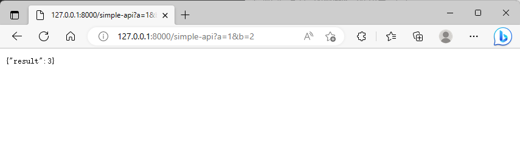</center>

　　这时如果我们缺失了某个参数，或是某个参数类型输入有误，都会返回错误信息：

- 参数缺失

<center >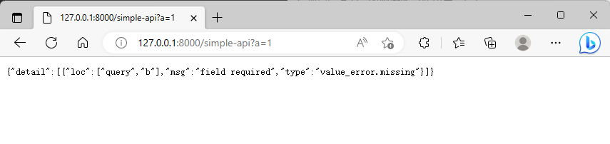</center>

- 参数类型有误

<center >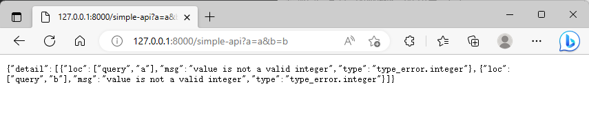</center>

　　这是因为`FastAPI`中带有完善的接口参数类型声明，我们在`a: int`和`b: int`中明确限定了各自的类型，且没有设置默认值，如果需要设置参数的默认值，将接口函数改写如下即可：

```python
@app.get('/simple-api')
def simple_api(a: int = 0, b: int = 0) -> dict:

    return {
        'result': a + b
    }

```

<center >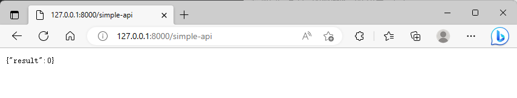</center>

　　知晓了`FastAPI`中`get`请求的基础用法后，下面我们基于我们的`流程元信息表`数据库模型来写一个简单的接口，用于实现根据`流程id`查询对应`流程名称`和`流程描述`的功能，其中完善了接口的推荐标准写法，用于妥善处理各种情况：

> main.py

```python
from fastapi import FastAPI

# 导入所需的数据库模型类
from models.nosql import ProcessMeta

# 实例化FastAPI应用对象
app = FastAPI()

# 实例化流程元信息表模型类
process_meta = ProcessMeta()


@app.get('/query-process-name-and-description')
def query_process_name_and_description(process_id: str) -> dict:

    try:

        # 尝试查询目标流程信息
        match_process = list(
            process_meta
            .collection
            .find(
                {
                    '流程id': process_id
                },
                {
                    '流程名称': 1,
                    '流程描述': 1
                }
            )
        )[0]

        return {
            'status': 'success',
            'data': match_process
        }

    except Exception as e:

        return {
            'status': 'error',
            'message': str(e)
        }

```

　　通过上面的接口，当我们输入库中存在的`流程id`时，就会返回相应的信息：

<center >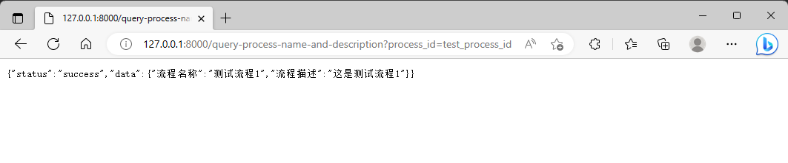</center>

　　而当输入的`流程id`在库中不存在时，也会返回相应的错误状态信息，我们在日常使用中可以对此过程进行自由的自定义：

<center >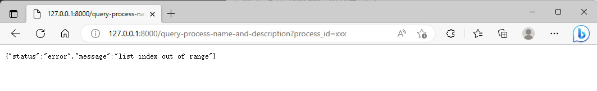</center>

###### 1.1.2 在FastAPI中编写post接口

　　介绍完`FastAPI`中`get`请求接口的基础写法，接下来我们来学习更通用的`post`请求接口写法，当我们的请求参数类型比较复杂，数据量较大时，`post`请求就非常的受用了。

　　在`FastAPI`中推荐基于`pydantic`中的`BaseModel`来设计`post`接口的输入参数，下面是一个简单的`post`接口示例，其参数`input_list`接受整数或浮点数构成的数组，并计算其中的最小最大值作为返回值：

> main.py

```python
# 用于复杂类型声明
from typing import Union, List
from fastapi import FastAPI
from pydantic import BaseModel

# 实例化FastAPI应用对象
app = FastAPI()


class PostDemo(BaseModel):

    # 声明输入参数input_list
    input_list: List[Union[int, float]]


@app.post('/post-demo')
def post_demo(params: PostDemo):

    return {
        'min': min(params.input_list),
        'max': max(params.input_list)
    }

```

　　由于`post`接口无法在浏览器地址栏中直接访问，我们接下来将`jupyter`作为接口测试工具，配合`requests`库进行模拟请求访问，请自行在`approval-process-api`环境中安装`requests`：

> notebooks/接口服务测试.ipynb

　　可以看到，测试过程和结果非常清楚，推荐大家也使用`jupyter`作为日常接口测试工具：

<center >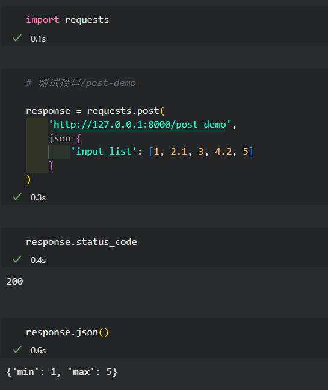</center>

　　从上面的简单例子中我们可以总结出编写`FastAPI`中`post`请求接口的基础范式（虽然`FastAPI`中定义接口的方式多种多样，但我建议大家越简单越好，一招鲜吃遍天）：

- 基于`pydantic.BaseModel`为指定接口设计入参
- 在`post`接口中用`params`参数来代表全部参数，再在接口函数中按需取用各子参数

###### 1.1.3 使用FastAPI自带的接口文档

　　`FastAPI`中有一点非常实用，它会为我们服务中实际存在的接口自动生成在线文档页，有基于`swagger`和`redoc`的两种页面，分别访问服务的`/docs`和`/redoc`即可看到（注意，由于`FastAPI`使用了在线CDN资源来生成文档页，因此要正常访问上述两种文档页需要翻墙，或者自行本地更改相关资源地址，[参考示例](https://t.zsxq.com/0cmtdQfHK)）：

- swagger

<center >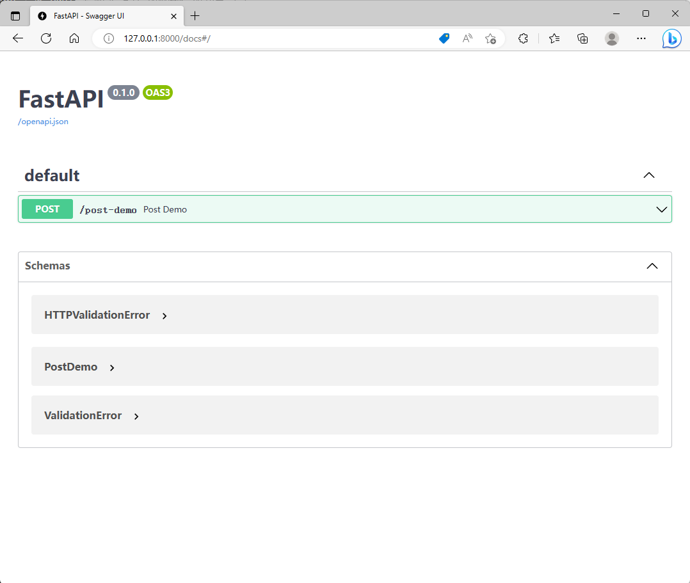</center>

- redoc

<center >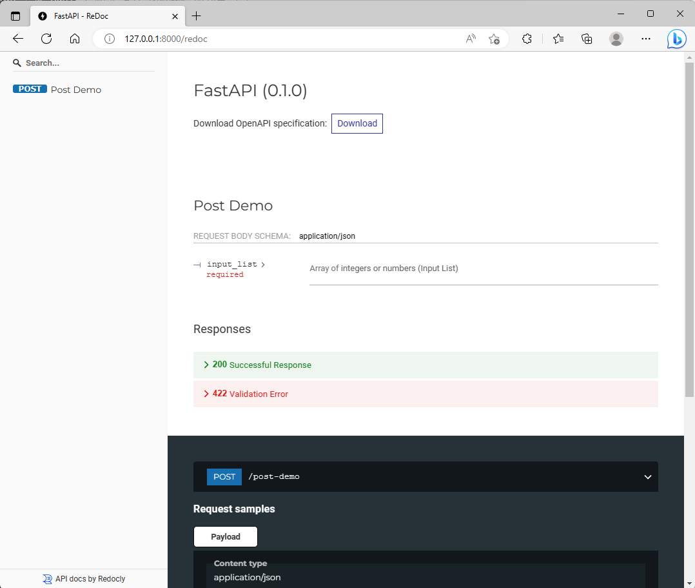</center>

　　具体用法比较简单，请大家自行去探索。

##### 1.2 APIRouter的使用

　　当我们的服务项目日益复杂，将所有的接口都写在`main.py`里显然不是明智的选择，这时我们需要对项目工程进行拆分，`FastAPI`为我们提供了方便快捷的`APIRouter`机制，类似`Flask`中的蓝图，譬如我们现在将整个工程中的接口划分成<u>通用接口</u>、<u>管理接口</u>和<u>查询接口</u>3种类型，就可以将<u>通用接口</u>保留在`main.py`中，<u>管理接口</u>和<u>查询接口</u>拆分到子模块中：

> routers/manage.py

```python
from fastapi import APIRouter

router = APIRouter()

@router.get('/test1')
def test1() -> str:

    return '这是管理接口中的test1接口'
```

> routers/query.py

```python
from fastapi import APIRouter

router = APIRouter()

@router.get('/test2')
def test1() -> str:

    return '这是查询接口中的test2接口'
```

> main.py

```python
# 用于复杂类型声明
from typing import Union, List
from fastapi import FastAPI
from pydantic import BaseModel

# 导入子路由
from routers import manage, query

# 实例化FastAPI应用对象
app = FastAPI()


class PostDemo(BaseModel):

    # 声明输入参数input_list
    input_list: List[Union[int, float]]


@app.post('/post-demo')
def post_demo(params: PostDemo):

    return {
        'min': min(params.input_list),
        'max': max(params.input_list)
    }


# 并入管理接口
app.include_router(
    manage.router,
    prefix='/manage',
    tags=['管理接口']
)

# 并入查询接口
app.include_router(
    query.router,
    prefix='/query',
    tags=['查询接口']
)
```

　　这样重构我们的服务项目后，就可以分别以`/manage`和`/query`为前缀访问各自下属的接口：

<center >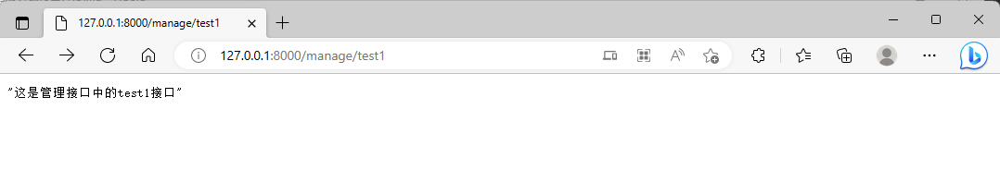</center>

<center >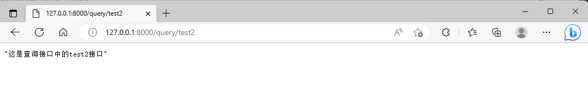</center>

　　并且在接口文档中，我们设置的`tags`标签也会被利用到，使得我们的项目更加清晰：

<center >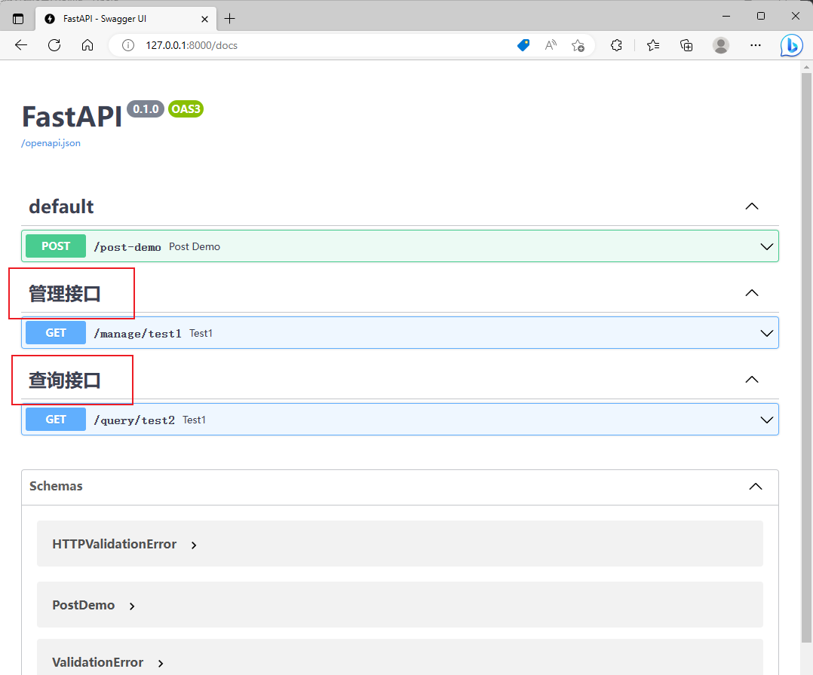</center>

　　以上就是本节课的主要内容，更多有关`FastAPI`的实用方法我们将在后续课程中再做具体介绍。

---

> 课后作业
>
> 　　请在认真学习本节课所述内容的基础上，针对`流程元信息表`模型类，分别完成：
>
> - 在`管理接口`中编写合适的接口，用于“新增一种流程的元信息”，并在`jupyter`中模拟接口访问以插入多条`流程类型`不同的示例数据
> - 在`查询接口`中编写合适的接口，用于接受多个`流程类型`，返回查询到的`流程名称`和`流程描述`字段信息
>
> 　　请单独发帖带上#课后作业#话题，注明“一起写个审批流应用课程第5讲课后作业”
